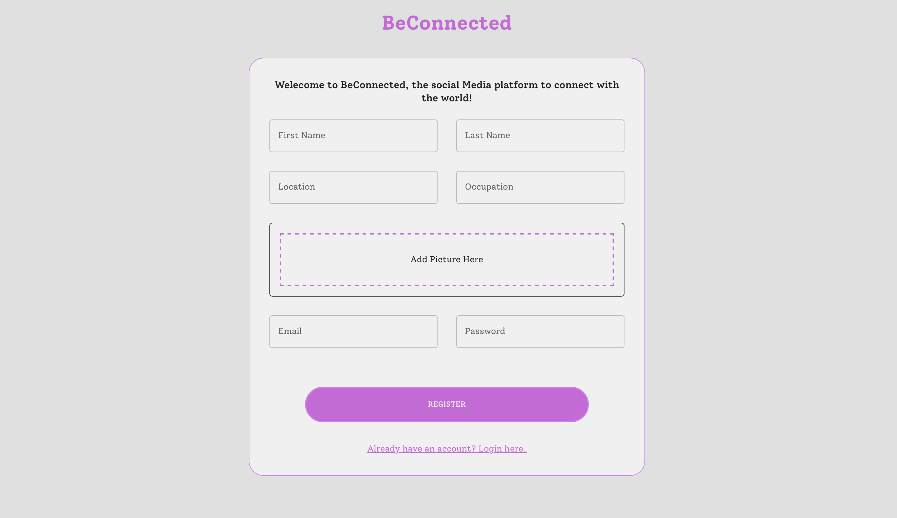
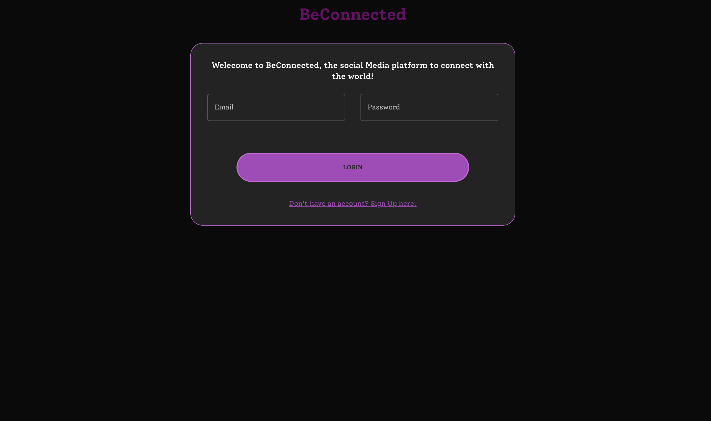
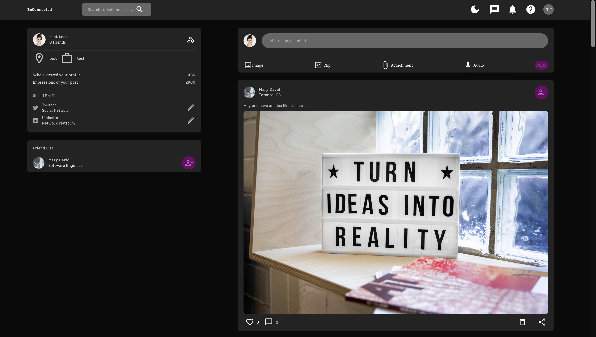
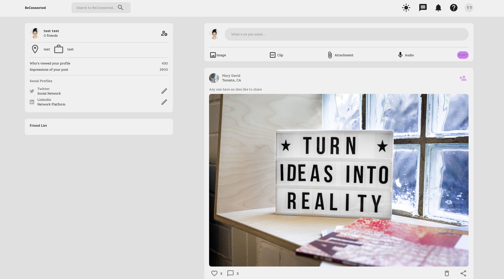
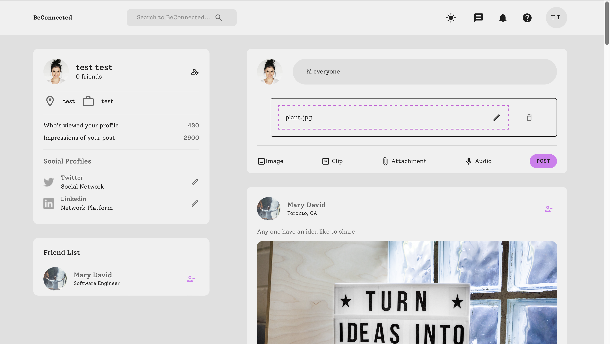

# BeConnected
## Summary

COMPLETE MERN Fullstack Responsive App with Auth, Likes, Dark/Light Mode, Comments, Posts delete your post and and remove friends  

## 
#### Register page

#### Login 

#### Home Dark Mode

#### Home Light Mode

#### posting Mode

Installation
1-Clone the repo
git clone [https://github.com/mays4/BeConnected](https://github.com/mays4/BeConnected)
To run FrontEnd 
cd client 
npm install 
npm run start
Runs the app in the development mode.\
Open [http://localhost:3000](http://localhost:3000) to view it in your browser.

To Run Backend
cd cd server 
npm install 
node index.js
Runs the app in the development mode.\
Open [http://localhost:3001](http://localhost:3001)

To visit live site 
To visit the live version [https://beconnected-zehb8iikb-mays.vercel.app](https://beconnected-zehb8iikb-mays.vercel.app)

#### FrontEnd
- React 
- MUI
- react-router-dom

#### BackEnd

- NodeJs
- Express
- bcryptjs
- cookie-parser
- cors
- jsonwebtoken

#### DataBase
- MongoDB

